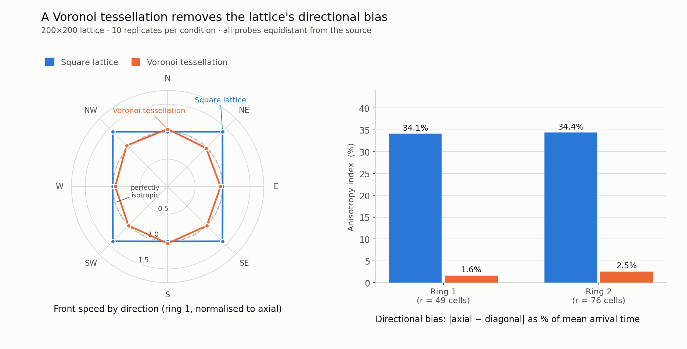
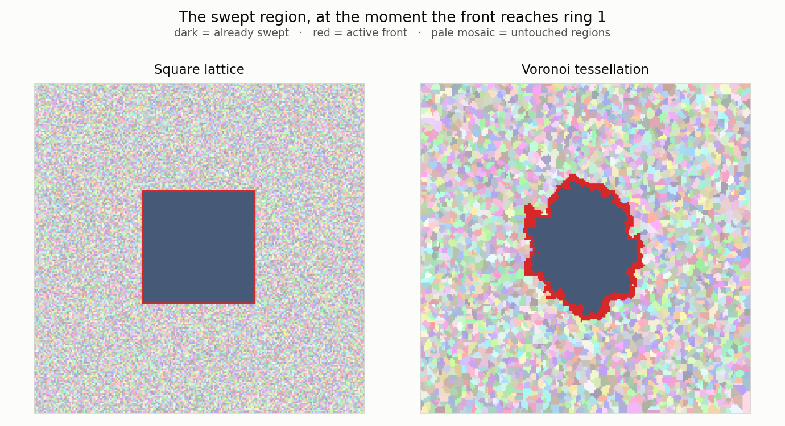

# Does a Voronoi tessellation remove lattice anisotropy?

A controlled numerical experiment in Common Lisp.

A cellular automaton on a square lattice does not spread isotropically: a
diffusion front advances faster along the lattice's diagonals than along its
axes, so a process that should be radially symmetric comes out square. This
repository measures that bias, and measures how much of it survives when the
automaton is run on a Voronoi tessellation instead of on the lattice itself.

**It does not survive.** Directional bias falls from **34%** to **under 3%**.



The left panel is the mechanism: front speed plotted against compass direction.
On the lattice it traces a square — the front reaches the diagonals ~41% sooner
than the axes. On the Voronoi tessellation it traces a circle.



---

## The question

Lattice anisotropy is a well-known artifact, and the usual fix is to abandon the
regular grid. But replacing a lattice with an unstructured mesh is expensive,
and it is rarely quantified what you actually buy. The question here is narrow
and answerable:

> If a cellular automaton runs on the *adjacency graph of a Voronoi
> tessellation* rather than on the lattice, how much of the lattice's
> directional bias is removed?

## Method

A front propagates outward from the centre of the domain across a graph, one
graph-hop per time step. Sixteen probes are placed on two concentric circles at
the four axial and four diagonal compass directions. Every probe on a circle is
at the **same Euclidean distance** from the source — the diagonal probes are
offset by *r*/√2 on each axis — so any systematic axial/diagonal difference is
anisotropy, not a difference in distance.

The anisotropy index is

```
|mean(axial arrival) − mean(diagonal arrival)| / mean(all arrivals) × 100
```

**The control is exact.** Both conditions run the *same code*. The only
difference is seed density:

| condition | seeds | result |
|---|---|---|
| `lattice` | one per lattice cell | the tessellation degenerates to the square lattice, and the region graph *is* the Moore neighbourhood |
| `voronoi` | one per ten lattice cells | regions span ~10 cells each |

Because the automaton, the probes, the measurement and the output path are
byte-for-byte identical between conditions, nothing but seed density can explain
a difference.

## Results

200×200 lattice, 10 replicates per condition, seeds 20210728–20210737:

| condition | ring | regions | axial | diagonal | anisotropy |
|---|---|---|---|---|---|
| lattice | 1 (r=49) | 40,000 | 48.00 | 34.00 | **34.15%** |
| lattice | 2 (r=76) | 40,000 | 75.00 | 53.00 | **34.38%** |
| voronoi | 1 (r=49) | 3,804 | 10.90 | 10.72 | **1.62%** |
| voronoi | 2 (r=76) | 3,804 | 16.90 | 16.48 | **2.55%** |

Bias is reduced **21×** at ring 1 and **13×** at ring 2.

Two things are worth noting beyond the headline:

- **The lattice bias does not decay with distance** (34.15% → 34.38%). It is a
  systematic geometric error, not noise, so averaging over a longer path will
  not remove it. This is the reason it matters.
- **The Voronoi bias is small but not zero.** Voronoi does not make the error
  vanish; it converts a *coherent* directional bias into *incoherent* cell-size
  noise, which does average out. The residual 1.6–2.6% is consistent with
  measurement quantisation at integer time steps.

### Validation

The lattice result has an analytic prediction, which makes it a test of the
measurement apparatus rather than just an output. Under a Moore neighbourhood a
front advances one cell per step in the *Chebyshev* metric, so a probe at
Euclidean radius *r* on a diagonal is reached in *r*/√2 steps while an axial
probe takes *r*. The predicted axial:diagonal ratio is therefore √2 ≈ 1.41421.

Measured: **48/34 = 1.4118** (ring 1) and **75/53 = 1.4151** (ring 2) — within
0.4% of the analytic value at both radii. The apparatus measures what it claims
to measure.

## Reproducing it

Needs SBCL. No Quicklisp, no external Lisp libraries, no display.

```sh
sbcl --script run.lisp            # 200x200, 5 replicates per condition
sbcl --script run.lisp 200 10     # what produced the table above (~60 s)
python3 analysis/analyse.py       # summary table + both figures
```

The analysis step needs `matplotlib`, `numpy` and `pillow`.

Every trial is seeded (`*seed*` + replicate index) and the seed is written into
the output CSV, so any row can be reproduced exactly.

## Layout

```
src/package.lisp       package definition
src/utils.lisp         list/numeric helpers, CSV, deterministic seeding
src/grid.lisp          the lattice; von Neumann and Moore neighbourhoods
src/voronoi.lisp       seeding, region growth, region adjacency graph
src/propagation.lisp   the front-propagation automaton
src/ppm.lisp           dependency-free image output
src/measurement.lisp   probe placement and the single-trial loop
src/experiment.lisp    the two-condition driver
analysis/analyse.py    statistics and figures
```

## Performance

The original implementation took **113 s for a single trial** at this size. The
version here runs **20 trials in 63 s**. Two changes account for almost all of
it, and both were verified to leave the output unchanged:

- **Region adjacency**, built in one pass into a hash table rather than by
  rescanning the entire lattice once per region ID. At 200×200 with 40,000
  regions the original did ~1.6 × 10⁹ array reads to compute something
  obtainable in one sweep. Measured **41× faster at 100×100 and 95× at
  150×150**, with adjacency sets identical for all 8,978 regions tested.
- **The front update**, which rebuilt its list with `remove` while iterating it —
  quadratic in front size, and ~60% of remaining run time once adjacency was
  fixed. Since every element of the old front is removed by the end of a sweep,
  the surviving list is exactly the newly added regions, so they can be
  accumulated directly. Membership moved to a hash set mirroring the list.

Neither change touches the algorithm. Both were checked against the original
output before being kept.

## Limitations

Stated plainly, because they bound what the result supports:

- **2D only.** The 3D case is harder and the result here does not transfer to it
  automatically: no 3D Bravais lattice with a single-speed neighbour set has an
  isotropic fourth-rank tensor, which is why hexagonal geometry rescues the 2D
  case and nothing so simple rescues 3D.
- **The Voronoi layer is not free.** Regions have ~15.5 face-neighbours in 3D
  against 6 on a cubic grid, memory access is indirect rather than strided, and
  the smallest cell sets the explicit stability limit. For pure diffusion an
  isotropic 27-point Laplacian is far cheaper; for hydrodynamics, lattice
  Boltzmann (D3Q19) is rank-4 isotropic on a plain cubic grid. This experiment
  quantifies what the tessellation buys, and is not an argument that it is
  always the right purchase.
- **Arrival time is quantised** to integer steps. At the Voronoi seed density
  used here a ring-1 crossing takes ~11 steps, so one step is ~9% — the residual
  1.6% bias is below the resolution of a single trial and is only meaningful
  averaged over replicates.
- **The recorded time is when the front finishes passing a probe**, not when it
  first arrives. Both are valid front-timing measures and the same definition is
  applied to all sixteen probes, so the axial/diagonal comparison is unaffected.
- **One tessellation family, one seed density.** Bias as a function of seed
  density is not mapped here, and Poisson–Voronoi is only one choice; Lloyd
  relaxation would narrow the cell-size distribution and probably reduce the
  residual noise further.

## Provenance

This began as an exploratory org-mode lab notebook written in 2021 — 39,000
lines, 938 source blocks, 53 successive versions of the same program, with every
function redefined an average of nine times as the design changed. That notebook
is a record of thinking, not a program: nothing in it could be loaded as a
library, because all ~60 functions were nested inside a single function and only
came into existence as a side effect of running the experiment.

This repository is the final iteration extracted, de-duplicated, given a module
structure, made deterministic, and reduced from twelve external dependencies to
zero. The scientific result is unchanged; the two bugs found while extracting it
are described in the commit history.

## Licence

MIT — see [LICENSE](LICENSE).
